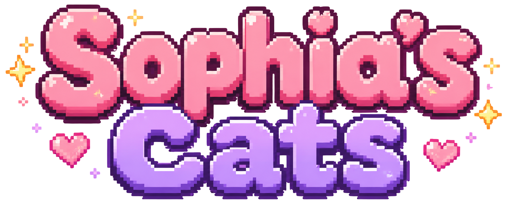

# 🌸 Sophia's Cats

<p align="center">
  
</p>

<p align="center">
  <strong>Um jogo educativo em estilo Cozy Pixel Art criado para ajudar crianças a aprender brincando.</strong>
</p>

---

## 💖 Sobre o projeto

O **Sophia's Cats** é um jogo educativo desenvolvido em **React** com estética **Cozy Pixel Art**, criado para auxiliar crianças no processo de alfabetização através de atividades lúdicas, personagens carismáticos e recompensas.

O projeto nasceu de um pedido da minha filha, **Sophia**, que queria um jogo de gatinhos para aprender brincando.

A partir dessa ideia surgiu a Mimi, a primeira personagem do jogo e guia da aventura.

---

## ✨ Objetivos

- Auxiliar na alfabetização.
- Trabalhar reconhecimento de letras e palavras.
- Estimular memória e atenção.
- Recompensar conquistas com estrelas.
- Criar uma experiência acolhedora e divertida.

---

## 🐱 Personagens

### Mimi

A Mimi é a mascote do jogo.

Ela acompanha a criança durante toda a aventura, oferecendo incentivo, carinho e celebrações a cada conquista.

---

## 🎨 Estilo visual

- Cozy Pixel Art
- Paleta em tons pastel
- Interface inspirada em jogos aconchegantes
- Animações suaves
- Experiência pensada para crianças

---

## 🛠 Tecnologias

- React
- Vite
- JavaScript
- CSS3
- Git
- GitHub

---

## 🚀 Status do projeto

### ✅ Concluído

- Estrutura inicial
- Tela inicial
- Identidade visual
- Logo oficial
- Personagem Mimi
- Organização dos assets
- Documentação inicial
- Versionamento com Git

### 🔄 Em desenvolvimento

- Animação da Mimi
- Primeira atividade de alfabetização
- Sistema de estrelas
- Sons
- Vila dos Gatinhos
- Sistema de progresso

---

## 📸 Prévia

> Em breve.

---

## 💻 Como executar

```bash
npm install

npm run dev
```

---

## 🌸 Desenvolvido por

**Rebecca Bomfim**

Estudante de Engenharia de Software.

Projeto desenvolvido com muito carinho para minha filha Sophia.